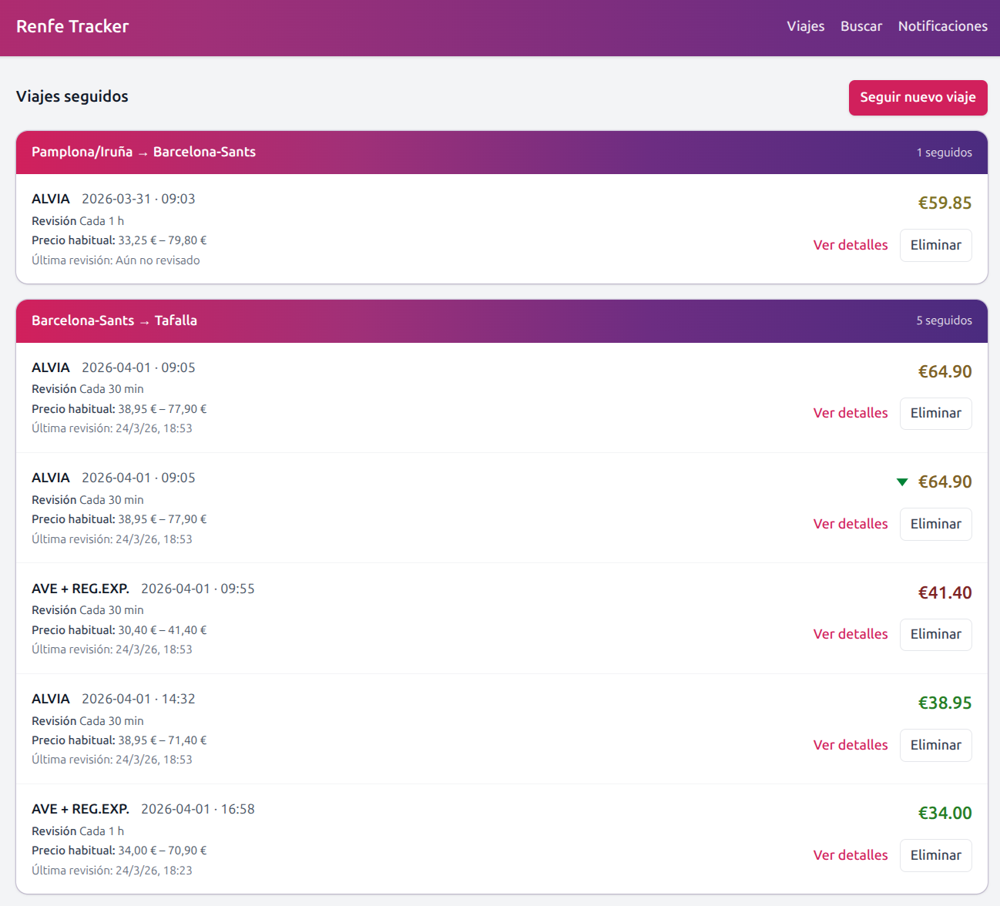
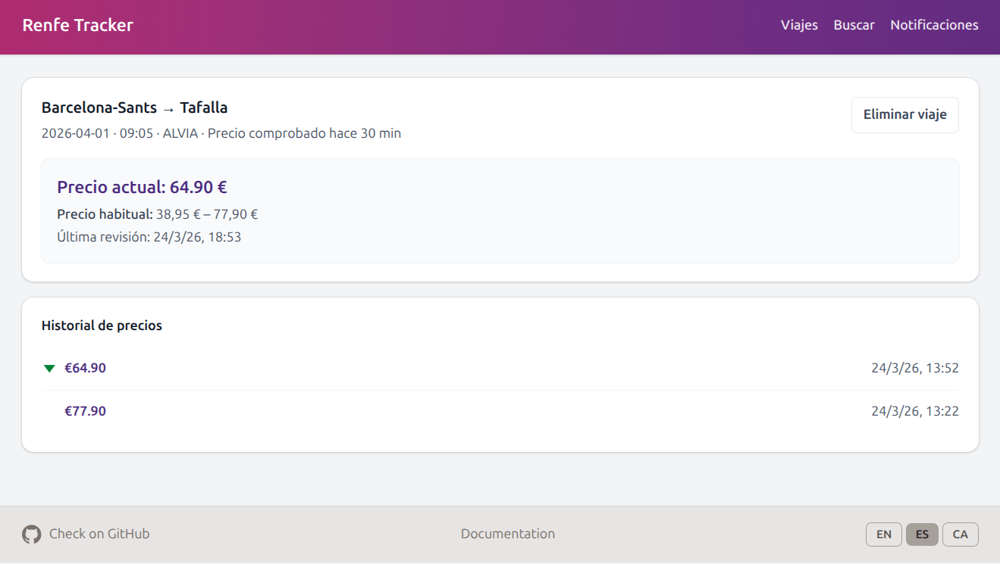
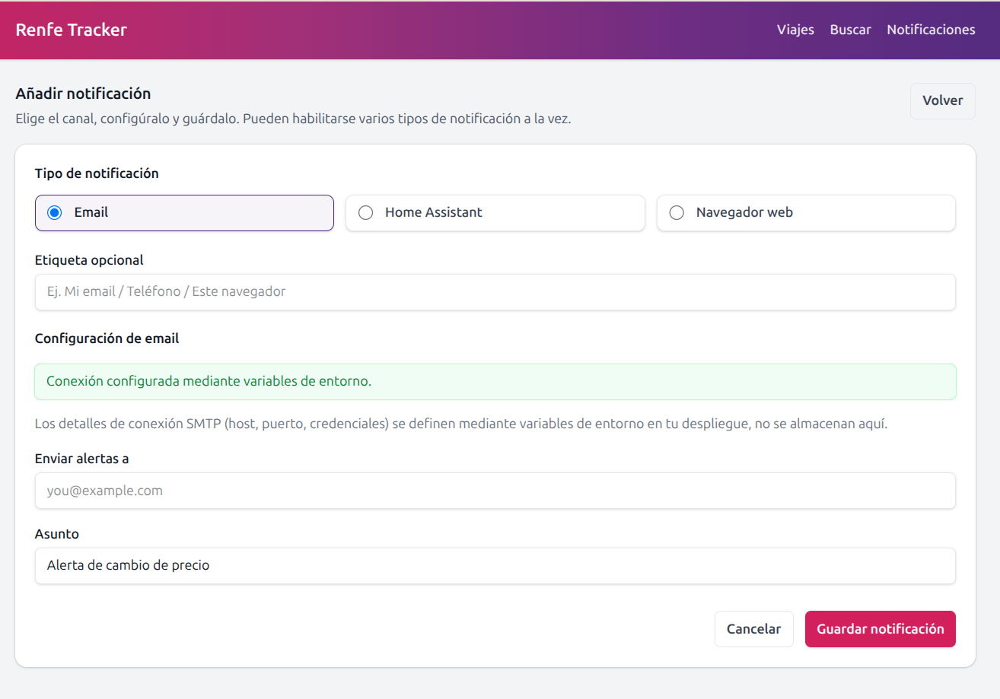

# Renfe Tracker

[](https://hub.docker.com/repository/docker/jmonton/renfe-tracker/tags)

Sigue trenes y precios de Renfe (media/larga distancia). Diseñado para ser "self-hosted", preparado para Docker.

Las funcionalidades, instalación y configuración están explicadas en la [**web de documentación**](https://JavierMonton.github.io/renfe-tracker/es/).


Con esta aplicación, se puede buscar trenes de Renfe, ver trenes posibles aún no publicados, ver rangos de precio estimados,
y seguir viajes para recibir alertas cuando el precio cambie.


---

## Tabla de contenidos

- [Español](#renfe-tracker)
  - [Funcionalidades](#funcionalidades)
  - [Ejecutar con Docker](#ejecutar-con-docker)
    - [Ejecutar con compose (recomendado para 24/7)](#ejecutar-con-compose-recomendado)
  - [Configuración](#configuración)
- [English](#english)
  - [Features](#features)
  - [Run with Docker](#run-with-docker)
    - [Running with compose (recommended for 24/7)](#running-with-compose-recommended)
  - [Configuration](#configuration)

---

## Funcionalidades

- Ver rangos de precio y trenes posibles:
Al buscar trenes, la aplicación muestra rangos de precio estimados basados en datos históricos y destaca trenes posibles que quizás aún no estén publicados.


- Seguir varios viajes:


- Ver cambios de precio históricos:



- Notificaciones de cambios de precio vía email, Home Assistant o notificaciones del navegador


## Ejecutar con Docker

La imagen está publicada en Docker Hub como [`jmonton/renfe-tracker:latest`](https://hub.docker.com/r/jmonton/renfe-tracker) — no es necesario compilar.

Expone el puerto **8000** y necesita un **volumen de datos** en `/data` (base de datos SQLite, datos GTFS en `/data/renfe_schedule`). Móntalo para persistir los datos entre reinicios.

### Ejecutar con compose (recomendado)

Copia el [fichero compose de ejemplo](docker-compose.example.yml) e inícialo:

```bash
cp docker-compose.example.yml docker-compose.yml
docker compose up -d
```

Abre **http://localhost:8000**. Para cambiar el puerto del host, establece `PORT` en un fichero `.env` (p. ej. `PORT=8080`) o en línea (p. ej. `PORT=8080 docker compose up -d`).

El fichero compose monta `./data` en `/data` y usa `restart: unless-stopped` para que la aplicación se reinicie automáticamente tras fallos o reinicios del sistema. Puedes reemplazar `./data` con tu propia ruta (p. ej. `/srv/renfe-tracker/data`) para que la base de datos y la configuración queden en tu host.

**PUID / PGID (opcional):** El proceso de la aplicación se ejecuta como root dentro del contenedor para poder crear y escribir la base de datos en el primer arranque (evita problemas de permisos con volúmenes bind-mounted). Si estableces `PUID` y `PGID`, el entrypoint hará chown de `/data` y `/app` a ese usuario cuando sea posible, de modo que los ficheros en el host (p. ej. `./data`) queden en propiedad de tu usuario. Puedes ejecutarlo con la propiedad que prefieras; la aplicación seguirá ejecutándose como root y escribirá en `/data`.

**Búsqueda (Renfe):** La aplicación usa la **librería Renfe integrada** (horarios GTFS + scraping de precios en vivo vía DWR). No se necesita ningún servidor MCP ni navegador externo; todo funciona dentro de este proyecto. Los datos GTFS se descargan automáticamente en el primer uso en `DATA_DIR/renfe_schedule` (en Docker, `/data/renfe_schedule`).
Para probar la búsqueda **sin** realizar llamadas reales a Renfe, establece `RENFE_MOCK=1` (o `RENFE_USE_MOCK=true`): la API devuelve una lista fija de trenes de ejemplo.

## Configuración

Para más información y configuraciones, consulta la [web de documentación](https://javiermonton.github.io/renfe-tracker/configuration).

---

# English

Track Renfe trains and prices (media/larga distancia). Self-hosted, runs in Docker.

Features, installation, and configuration,
explained in the [**Documentation website**](https://JavierMonton.github.io/renfe-tracker/).


Using this application, a user can search for Renfe trains, see possible trains not published, see estimated price ranges,
and track trips to get notified of price changes.


---

## Features

- See Price Ranges and Possible Trains:
When searching for trains, the app shows estimated price ranges based on historical data and highlights possible trains that may not be published yet.


- Track multiple trips:


- See historical price changes:


- Notifications of price changes via email, Home Assistant, or browser notifications:
  


## Run with Docker

The image is published on Docker Hub as [`jmonton/renfe-tracker:latest`](https://hub.docker.com/r/jmonton/renfe-tracker) — no build step required.

It exposes port **8000** and expects a **data volume** at `/data` (SQLite DB, GTFS data in `/data/renfe_schedule`). Mount it to persist data across restarts.

### Running with compose (recommended)

Copy the [example compose file](docker-compose.example.yml) and start:

```bash
cp docker-compose.example.yml docker-compose.yml
docker compose up -d
```

Open **http://localhost:8000**. To change the host port, set `PORT` in a `.env` file (e.g. `PORT=8080`) or inline (e.g. `PORT=8080 docker compose up -d`).

The compose file mounts `./data` to `/data` and uses `restart: unless-stopped` so the app restarts automatically after failures or reboots. You can replace `./data` with your own path (e.g. `/srv/renfe-tracker/data`) so the database and config stay on your host.

**PUID / PGID (optional):** The app process runs as root inside the container so it can always create and write the database on first run (avoids permission issues with bind-mounted volumes). If you set `PUID` and `PGID`, the entrypoint will chown `/data` and `/app` to that user when possible, so files on the host (e.g. `./data`) end up owned by your user. You can then run with your preferred ownership; the app will still run as root and write to `/data`.

**Search (Renfe):** The app uses the **integrated Renfe library** (GTFS schedules + live price scraping via DWR). No separate MCP server or browser is required; everything runs inside this project. GTFS data is downloaded automatically on first use into `DATA_DIR/renfe_schedule` (in Docker, `/data/renfe_schedule`).
To test search **without** any real Renfe calls, set `RENFE_MOCK=1` (or `RENFE_USE_MOCK=true`): the API returns a fixed list of example trains.

## Configuration

For configuration options, refer to the [documentation website](https://javiermonton.github.io/renfe-tracker/configuration).
